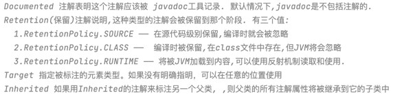
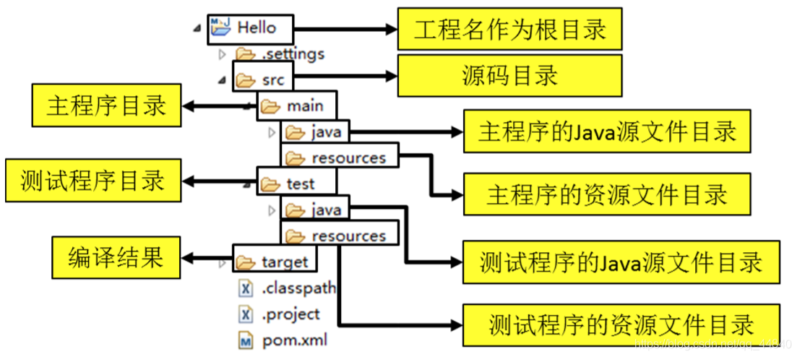

[TOC]
#  <center>java_advance<center>
## I/O流
### 输入
  + 字符输入流：Reader -> FileReader
  + 字节输入流：InputStream -> FileInputStream
  `字节类型：byte -> 8 bits 表示为ASCALL码`
### 输出
  + 字符输出流：Writer -> FileWriter
  + 字节输出流：OutputStream -> FileOutputStream
### classpath
+ 顾名思义，类路径即为 *.class 文件的路径，同时也包含各类资源文件
+ 文件加载方法：getResourceAsStream(String path) 
  + class调用，则为类路径 `path以’/'开头,从类路径读取文件`
  + classLoader()调用，则为类加载器路径 `path不以’/'开头,从此类所在的包下取资源`

### Properties（Java.util.Properties）
+ 该类主要用于读取Java的配置文件，如*.properties文件
+ 以键值对的形式进行参数配置：value=getProperty(key)
+ 使用load()方法加载文件
### File
+ 仅为对象，可调用exists()方法判断是否存在
+ 常用方法包含：isDirectory()  isFile()  list()  listFiles()
### try with resource
```java
try{
    //可能抛出异常的代码
}
catch(){
    //捕获异常
}
finally{
    //最终执行的代码，释放资源
}
```
### Files 
+ 工具类，比较简单，无需释放操作(简单文件操作推荐使用)
## Generics(泛型)
### why？
+  ==保障类型安全==:编译器可以帮助我们检查出类型错误
### 常用类型参数

## Reflection(反射)
### 原理
+ 包含类对象，可以通过class对象反向获取对象(字段)信息
+ 一个类只产生一个class对象
### 使用
+ get class  
> Class.forName(包名+类名)  
> 类名.class  
> 对象.getclass()  
+ get fields  
>public: getFields()  
>public/private: getDeclareFields()  
>getDeclareField("name")  
+ get/set field value 
>nameField.setAccessible(true);  
>nameField.get(对象)  
>nameField.set(对象,"fieldValue")  
+ get methods
>getMethods()  
>getDeclareMethods()  
>getMethod("name")  
+ create an object 
>Class userClass = Class.forName("name"); userClass.newInstance();  
>Constructor constructor = userClass.getConstructor(T1,T2);  constructor.newInstance(T1,T2);  
>Method method = userClass.getMethod("name",class); method.invoke(user,"name");  
## Annotation(注解)
### why？
+ 特殊注解，可以帮助编译器检查错误(编译时检查)
### 自定义注解
+ 基本条件：注解范围(Target)&生命周期(Retention)
+ 元注解:

+ 注解自定义属性格式： type name() default value;
  `有默认值时，使用注解可省略value，否则必须显式声明`
+ **可以通过反射机制读取注解内容**
## Maven(项目管理工具)
### what？
自动的标准化项目管理(内置于IDEA)
### 目录结构

### pom.xml
+ POM:项目对象模型，maven工程的核心配置文件
+ 三维坐标定义jar：groupId artifactId version
### dependency
+ 范围(scope)
  + **compile**：表示编译范围，指 A 在**编译**时依赖 B，该范围为默认依赖范围。编译范围的依赖会**用在编译，测试，运行**，由于运行时需要，所以编译范围的依赖会被**打包**。
  + **provided**：provied 依赖只有当 jdk 或者一个容器已提供该依赖之后才使用。provide 依赖在**编译和测试时需要**，在运行时不需要。例如：**servlet api**被Tomcat容器提供了。
  + **runtime**：runtime 依赖在**运行和测试系统时需要**，但在编译时不需要。例如：**jdbc** 的驱动包。由于运行时需要，所以 runtime 范围的依赖会被打包。
  + **test**：test 范围依赖在编译和运行时都不需要，只在**测试**编译和测试运行时需要。例如：**Junit**。由于运行时不需要，所以 test 范围依赖不会被打包。
  + **system**：system 范围依赖与 provide 类似，但是必须显示的提供一个对于本地系统中 jar 文件的路径。一般不推荐使用。
+ 传递：complie可以形成依赖传递，test和provided不能形成
+ 排除：在依赖中使用exclusions进行依赖的排除，但不用指定版本号
## Unit Testing（JUnit）
### 优点
- 测试代码和功能代码分开
- 自动化运行并生成测试报告
### 断言
+ 编写测试用例的核心实现方式
+ 核心方法：assertEquals(),assertNull(),assertSame(),assertTrue()
### 注解
+ @test：测试方法，可测试期望异常
+ @BeforEach & @AfterEach：重复执行，保证相同的测试环境
+ @BeforeClass & @AfterClass：针对所有测试只执行一次
+ @Before：初始化方法
+ @After：释放资源
  `执行顺序为@BeforeClass -> @Before -> @test -> @After -> @AfterClass`
### 原则：
**F I R S T**