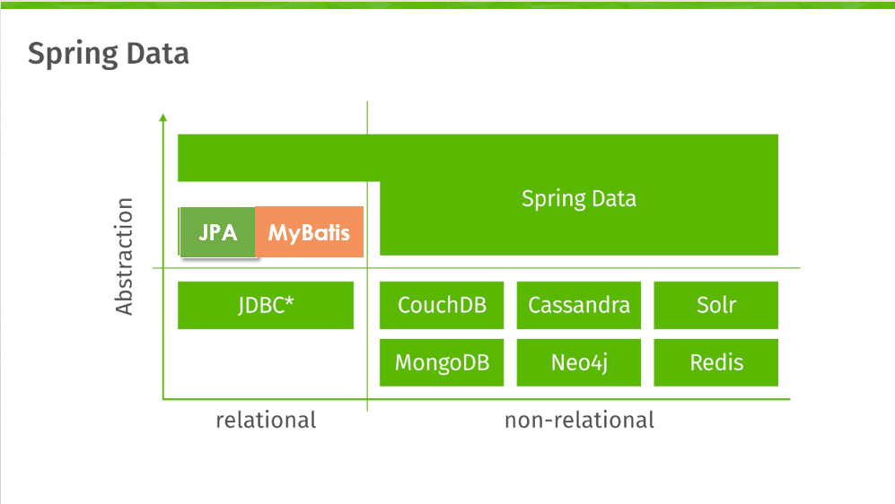

[TOC]
# <center>MyBatis-Plus</center>
## 1.Spring Data
### 数据库类型

### ORM
+ 在对象和关系型数据库之间建立映射
+ 可以通过操作类对象直接访问数据库
+ JPA和MyBaits均为ORM frameworks
## 2.Mybatis
### 引入依赖
```java
//MyBatis工具
<dependency>
	<groupId>com.baomidou</groupId>
    <artifactId>mybatis-plus-boot-starter</artifactId>
	<version>3.4.1</version>
</dependency>
//连接MySQL数据库
<dependency>
	<groupId>mysql</groupId>
	<artifactId>mysql-connector-java</artifactId>
	<version>8.0.32</version>
	<scope>runtime</scope>
</dependency>
```
### Mybatis with annotation
+ @Mapper: 一般用在Dao层接口上，相当于mapper.xml文件，将接口生成一个动态代理类。注意：在Dao层不要存在相同名字的接口，否则导致mapper文件映射出错。
+ @MapperScan:当一个项目中存在多个Dao层接口时，需要对每个接口写上@Mapper注解,可以使用@MapperScan注解进行一次性的注入
+ @Select:取代mapper.xml中的select标签，只作用于方法上面。
+ @TableName:设置实体类所对应的类名
+ @TableId:将属性标识为主键，并可通过type指定生成主键的方式
  + AUTO: 数据库ID自增。该类型请**确保数据库设置了 ID自增（AUTO_INCREMENT）** 否则无效
  +	NONE: 不设置id生成策略
  +	INPUT:用户手工输入id
  + ASSIGN_ID:雪花算法生成id(可兼容数值型与字符串型)
  + ASSIGN_UUID:以UUID生成算法作为id生成策略
+ @TableField:设置属性所对应的字段名,在实体类属性上使用
  + exist：标识此属性是否在数据库中存在
+ @Param:给参数命名，为SQL语句赋值
### one-to-many query
+ @Results: id作为唯一标识，value存储result
+ @result：column和propery用于配置数据库中列名和类中的属性名之间的映射关系，many用于一对多映射
+ @Many：select用于指定关联查询的方法
## 3.MyBatis-plus
### Introduction
+ 只做增强，不做改变
+ 内置Mapper告别SQL
+ 内置分页插件、代码生成器
### BaseMapper
+ 集成了一些基本的CRUD的方法
### QueryMrapper & LambdaQueryWrapper
```java
//1.普通写法
QueryMapper<T> qw= new QueryMapper<T>();
qw.gt("age",13);
//2.匿名解决硬编码
QueryMapper<T> qw= new QueryMapper<T>();
qw.lamba().gt(类名::Getter,13);
//3.采用LambdaQueryMapper
LambdaQueryMapper<T> lqw= new LambdaQueryMapper<T>();
lqw.gt(类名::Getter,13);
```
+ 自定义查询
@Param(Constants.Wrapper) 修饰 Wrapper
其中Constant.Wrapper= "ew"
### 条件构造器
+ 比较类：eq,ne,gt,ge,lt,le,between
+ like类：like,likeLeft,likeRight
+ sql条件：in,groupBy,orderBy,having,or,and
+ **条件间默认为and关系，若为或则需显示添加.or()**
### aggregation(聚合)
+ querymapper.(条件构造器).select("聚合表达式 as 别名")
### paging & sorting
1. 配置分页插件
```java
@Configuration
public class MpConfig {
    @Bean
    public MybatisPlusInterceptor mpInterceptor(){
        //1.定义Mp拦截器
        MybatisPlusInterceptor mpInterceptor = new MybatisPlusInterceptor();
        //2.添加具体的拦截器
        mpInterceptor.addInnerInterceptor(new PaginationInnerInterceptor());
        return mpInterceptor;
    }
}
```
2. 分页查询并排序
```java
void testGetByPage(){
//1、准备分页条件
Page<User> page = Page.of(pageNo,pageSize);
//2.准备排序条件
page.addOrder(new OrderItem(column,asc));
//3.分页查询
mapper.selectPage(page, null);
}
```
## 4.Code Generation
### 作用
可以根据数据库表帮助我们生成实体类、Mapper层等代码
### 引入依赖
```java
<dependency>
    <groupId>com.baomidou</groupId>
    <artifactId>mybatis-plus-generator</artifactId>
    <version>3.4.1</version>
</dependency>
<!--velocity模板引擎-->
<dependency>
    <groupId>org.apache.velocity</groupId>
    <artifactId>velocity-engine-core</artifactId>
    <version>2.3</version>
</dependency>
```
### 配置
```java
public class CodeGenerator {
    public static void main(String[] args) {
        //创建代码生成器
        AutoGenerator autoGenerator = new AutoGenerator();
        //配置数据源
        autoGenerator.setDataSource(dataSourceConfig());
        //全局配置
        autoGenerator.setGlobalConfig(globalConfig());
        //配置包名
        autoGenerator.setPackageInfo(packageConfig());
        //配置生成策略
        autoGenerator.setStrategy(strategyConfig());
        //执行生成操作
        autoGenerator.execute();
    }

    private static StrategyConfig strategyConfig() {
        StrategyConfig strategyConfig = new StrategyConfig();
        //设置当前参与生成的表名，参数为可 变参数
        strategyConfig.setInclude("user","role");
        //设置数据库表的前缀名称，模块名 = 数据库表名 - 前缀名 例如： User = tbl_user - tbl_
        //strategyConfig.setTablePrefix("tbl_");
        //设置是否启用Rest风格
        strategyConfig.setRestControllerStyle(true);
        // 设置乐观锁字段名
        //strategyConfig.setVersionFieldName("version");
        // 设置逻辑删除字段名
        //strategyConfig.setLogicDeleteFieldName("deleted");
        // 设置是否启用lombok
        strategyConfig.setEntityLombokModel(true);
        return strategyConfig;
    }
    private static PackageConfig packageConfig() {
        PackageConfig packageInfo = new PackageConfig();
        //设置生成的包名，与代码所在位置不冲突， 二者叠加组成完整路径
        packageInfo.setParent("edu.whu.demo");
        //设置实体类包名
        packageInfo.setEntity("domain");
        //设置数据层包名
        packageInfo.setMapper("dao");
        return packageInfo;
    }
    private static GlobalConfig globalConfig() {
        GlobalConfig globalConfig = new GlobalConfig();
        //设置代码生成位置
        globalConfig.setOutputDir(System.getProperty("user.dir")
                +"/mybatis-plus-codegenerator/src/main/java");
        //设置生成完毕后是否打开生成代码所在的目录
        globalConfig.setOpen(false);
        //设置作者
        globalConfig.setAuthor("jiaxy");
        //设置是否覆盖原始生成的文件
        globalConfig.setFileOverride(true);
        //设置数据层接口名，%s为占位符，指代模块名称
        globalConfig.setMapperName("%sDao");
        //设置Id生成策略
        globalConfig.setIdType(IdType.AUTO);
        return globalConfig;
    }
    private static DataSourceConfig dataSourceConfig() {
        DataSourceConfig dataSource = new DataSourceConfig();
        dataSource.setDriverName("com.mysql.cj.jdbc.Driver");
        dataSource.setUrl("jdbc:mysql://localhost:3306/userDB?serverTimezone=UTC");
        dataSource.setUsername("root");
        dataSource.setPassword("root");
        return dataSource;
    }
}
```
### multiple Modules
+ parent module 
  + 不需要编译为Jar：<packageing>com</packaging>
  + 子模块放在<modules></modules>
+ sub module
  + 继承父模块：<parent></parent>
## 5.Transaction
使用@Transactional进行事务回滚，防止产生垃圾数据