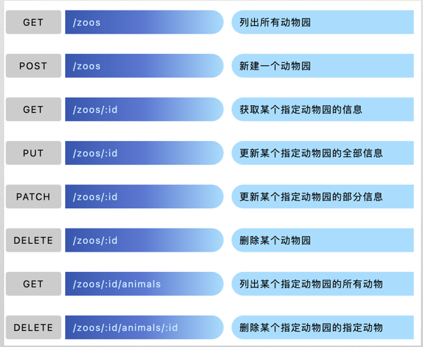

[TOC]
# <CENTER>Spring Boot</CENTER>
## 1. Web App Basics
### HTTP
HTTP协议(超文本传输协议HyperText Transfer Protocol)，它是基于TCP协议的应用层传输协议，是客户端和服务端进行数据传输的一种规则(C/S)。
### Traditional Web App
+ 应用程序的客户端要求简单，甚至要求只读。
+ 应用程序需在不支持 JavaScript 的浏览器中工作。
+ 团队不熟悉 JavaScript 或 TypeScript 开发技术。
### SPA（前后端独立）
+ 应用程序必须公开具有许多功能的丰富的用户界面。
+ 团队熟悉 JavaScript 或 TypeScript 开发。
+ 应用程序已为其他（内部或公共）客户端公开 API。
## 2. Hello,Spring Boot
### Spring MVC
+ Model(javabean)、View(jsp/img)、Controller(Action/servlet)。
+ 解决WEB开发中常见的问题(参数接收、文件上传、表单验证、国际化等等)，与Spring无缝集成。支持 RESTful风格的URL请求。
+ Spring MVC架构

### SSM
+ SpringMVC+Spring+Mybatis
+ model：

### Spring Boot
+ 用来简化新 Spring 应用的初始搭建以及开发过程。
###  Create Spring Boot 
+ with Spring Initializr(start.spring.io),download source code and open with idea
+ dependencies: Spring Web
+ Config File:yaml or properties & bulid-in or user-defined
## 3. Restful API
### @RestController & Controller@
+ @Controller for traditional MVC while
+ @RestController for Restful API
  + GetMapping()
  + PostMapping()
  + PutMapping()
  + DeleteMapping()
### Introduction
+ 以资源为基础
+ 统一接口：POST,DELETE,PUT,PATCH,GET
+ URI指向资源
+ 无状态、C/S
### 设计规范
+ request：动词+宾语

+ 状态码：
> 1xx：相关信息
2xx：操作成功
3xx：重定向
4xx：客户端错误
5xx：服务器错误
+ Lombok(dependency)
@Data provide default setter/getter
### PostMan
+ 为了验证接口能否被正常访问，我们常常需要使用测试工具，来对数据接口进行检测。
+ 好处：接口测试工具能让我们在不写任何代码的情况下，对接口进行调用和调试。
+ @PathVariable
  + 若方法参数名称和需要绑定的url中变量名称一致时,可以简写:
  ```java
  @RequestMapping("/{name}")
    public User getUser(@PathVariable String name){
       ...
    }
  ```
  + 若方法参数名称和需要绑定的url中变量名称不一致时，写成:
  ```java
  @RequestMapping("/{name}")
    public User getUser(@PathVariable("name") String userName){
       ...
    }
  ```
+ @RequestBody & @RequestParam
  + 在后端的同一个接收方法里，@RequestBody与@RequestParam()可以同时使用，@RequestBody最多只能有一个，而@RequestParam()可以有多个。
## 4. Swagger
### Introdution
+ 为API生成文档,致力于解决接口规范化、标准化、文档化的开源库
+ 引入依赖(springfox)
### Annotation
+ 用于类的注解
  + @Api：资源描述 values,**tags**,cosumes,etc.
  + @Apilgnore:资源过滤
  在文档中屏蔽接口
+ 用于方法的注释
  + @ApiOperation：方法描述
  **value**,**notes**,tags,etc.
  + @ApilmplicitParam:参数描述,可用于方法前
  name,value,required,param Type,etc.
  + ApiParam:参数描述，用于每个参数前面
  **name**,**value**,required,etc.
+ 用于实体类的注释
  + @ApiModel:实体类描述
  **value**(实体类备用名)，description，etc.
  + @ApiModelProperty:实体类成员描述
  **value**(字段说明),name,required
## 5. Vue + Rest API
### add front-end files into a Springboot project
+ index.html is the default page
### Vue 
+ 构建用户界面的渐进式框架
+ 基于MVVM风格的双向数据绑定的Javascript库
### Element-UI
+ 一套基于Vue2.0的桌面端组件库
### Axios
+ 一个基于 promise 的 HTTP 库，可以发送get、post请求