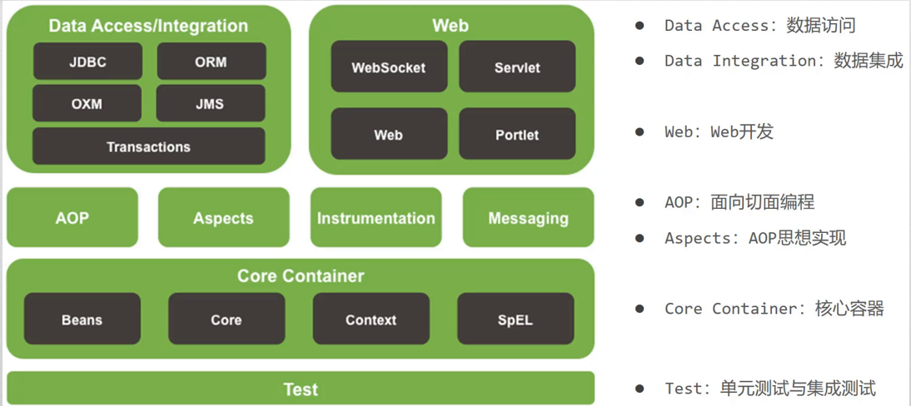

[TOC]
# <center>Spring Core</center>
## 1.Introduction
### 优点
+ 简化开发、高效集成的轻量级开发框架
+ 支持控制反转
### Spring框架：
  
## 2.Spring IOC
### 提出背景
  + 紧耦合：修改一处代码，往往需要修改多处代码
  + 解决方法：实现松耦合，通过接口实现通过由外部创建对象
  + 控制反转，即将对象的控制权由程序转移到外部
### IOC容器
+ 负责对象的创建、初始化等工作
+ 被创建或者被管理的对象被称为Bean
+ 在Bean之间实现依赖注入
## 3.创建Spring项目
1. 创建maven项目并在pom.xml中添加spring framework依赖(直接在maven repository复制相关代码防止出错)
2. 添加配置文件applicationContext.xml
3. 创建Java类，并在配置文件中声明bean
4. 使用IOC容器
## 4.Beans的声明周期
### scope(作用域)
+ singleton
  + 默认作用域
  + IOC容器中只存在一个共享实例，无状态
  + 自实例化开始将一直存活至容器销毁或退出
+ prototyoe
  + 适用于请求方不能共享的对象实例
  + 每个实例具有自己的状态
### instantiation(实例化)
```java
<!--第一种：在spring配置文件中直接配置类全路径，Spring会自动调用该类的无参数构造方法来实例化Bean-->
    <bean id="springBean" class="com.powernode.spring6.bean.SpringBean"/>
</beans>
<!--第二种：静态工厂模式。在Spring配置文件调用哪个类的哪个方法获取Bean-->
<!--factory-method 属性指定的是工厂类当中的静态方法-->
<bean id="star" class="com.powernode.spring6.bean.StarFactory" factory-method="get"/>
<!--第三种：实例工厂实例化。通过 factory-bean属性 + factory-method属性来共同完成。-->
<bean id="gunFactory" class="com.powernode.spring6.bean.GunFactory"/>
<!--factory-bean属性告诉Spring调用哪个对象。factory-method告诉Spring调用该对象的哪个方法。-->
<bean id="gun" factory-bean="gunFactory" factory-method="get"/>
<!--第四种：通过FactoryBean接口来实现，factory-bean会自动指向实现FactoryBean接口的类，factory-method会自动指向getObject()方法。-->
<bean id="person" class="com.powernode.spring6.bean.PersonFactoryBean"/>
```
### BeanFactory和FactoryBean
1 BeanFactory
Spring IoC容器的顶级父接口，是工厂。
2 FactoryBean
一个能够辅助Spring实例化其它普通Bean对象的工厂Bean。
### init & destory method
+ init-method：设置bean初始化生命周期回调函数
+ destory-method:设置bean销毁生命周期回调函数，仅适用于单例对象
### InitializingBean & DisposableBean
+ InitializingBean 接口为 bean 提供了 bean 属性初始化后的处理方法，它只有 afterPropertiesSet 一个方法，凡是实现此接口的类，在 bean 的属性初始化后都会执行该方法。
+ DisposableBean 接口为单例 bean 提供了在容器销毁 bean 时的处理方法，它只有 destroy 一个方法，凡是实现此接口的类，在 bean 被销毁时都会执行该方法。
## 5.依赖注入
### 注入数据类型
  + 基本数据类型和String
  + 其他bean类型（配置过的bean）
  + 复杂类型/集合类型
### 注入方法
1. 构造函数注入
   + 使用标签：constructor-arg
   + 标签中的属性：
     + type：指定要注入的数据类型，该数据类型也是构造函数中某个或某些参数的类型(不推荐)
     + index：指定要注入的数据给构造函数中指定索引位置的参数赋值。从0开始。
     + name：指定给构造函数中指定名称的参数赋值。
     + value：提供基本类型和String类型的数据
     + ref：指定其他在spring的Ioc核心容器中出现过的bean的id或者name
2. set方式注入
   + 使用标签：property
   + 标签中的属性：
     + name：指定注入时所调用的set方法名称
     + value：提供基本类型和String类型的数据
     + ref：指定其他在spring的Ioc核心容器中出现过的bean的id或者name
3. 集合类型注入
   + 使用标签：property
   + 标签中的属性：
     + name：指定注入时所调用的set方法名称
     + 集合赋值内容
4. 自动装配
   + auto-wire="byType"
      + 自动在容器上下文中查找，和自己对象set方法后面的值对应的beanId
      + 保证所有bean的id唯一 ，并且bean需要和自动注入的属性的set方法的值一致。
   + auto-wire="byName"
     + 自动在容器上下文中查找，和自己对象属性类型相同的bean
     + 保证所有bean的class唯一 ，并且这个bean需要和自动注入的属性的类型一致；全局唯一，id属性可以省略
## 6.IOC Containers
### 加载配置文件
   + 加载类路径下的配置文件
  ```java
  ApplicationContext ctx = new ClassPathXmlApplicationContext("xml文件")
  ```
   + 从文件系统下加载配置文件
```java
ApplicationContext ctx = new FileSystemXmlApplicationContext("文件绝对路径")
```
### 获取bean
```java
//by name
Class name=(Class)ctx.getBean("id");
//by name(Generic method)
Class name= ctx.getBean("id",Class.class);
//by Type
Class name= ctx.getBean(Class.class);

```
## 7.Spring注解
可以减少配置文件内容，更加便于管理，提高开发效率
### 组件类注解
  + **@Component** ：标注一个普通的spring Bean类。
  + **@Repository**：标注一个DAO组件类(数据访问层)
  + **@Service**：标注一个业务逻辑组件类(业务层)
  + **@Controller**：标注一个控制器组件类(控制层)
### 装配时注解
   + **@Autowired**：属于Spring 的org.springframework包下,可用于为类的属性、构造器、方法进行注值 
   + **@Resource**：不属于spring的注解，而是java.annotation包下，使用该annotation为目标bean指定协作者Bean。
   +  **@PostConstruct** 和 **@PreDestroy** 方法 实现初始化和销毁bean之前进行的操作
### 其他常见注解
+ @Configuration：声明当前类为Spring配置类
+ @scope：声明bean作用域
+ @Bean：主要用于方法上，类似于工厂方法